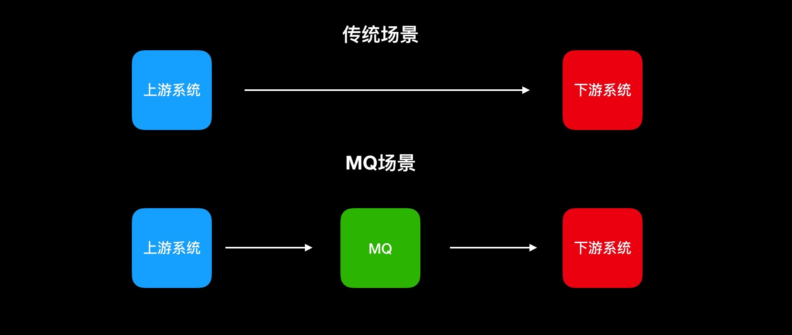
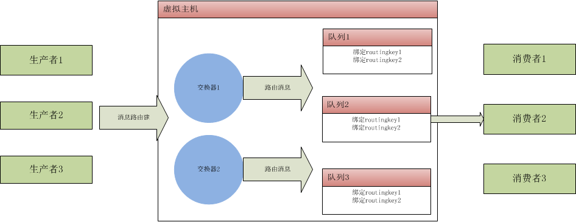

# MQ（消息队列）

## （一）介绍

### 1 MQ特点

- 先进先出
  不能先进先出，都不能说是队列了。消息队列的顺序在入队的时候就基本已经确定了，一般是不需人工干预的。而且，最重要的是，**数据是只有一条数据在使用中。** 这也是MQ在诸多场景被使用的原因。
- 发布订阅
  发布订阅是一种很高效的处理方式，如果不发生阻塞，基本可以当做是同步操作。这种处理方式能非常有效的提升服务器利用率，这样的应用场景非常广泛。
- 持久化
  持久化确保MQ的使用不只是一个部分场景的辅助工具，而是让MQ能像数据库一样存储核心的数据。
- 分布式
  在现在大流量、大数据的使用场景下，只支持单体应用的服务器软件基本是无法使用的，支持分布式的部署，才能被广泛使用。而且，MQ的定位就是一个高性能的中间件。

### 2 作用，目的

* 阻隔直达数据库的流量，缓存组件和***消息组件MQ***是两大杀器。 
* 应用解耦（异步）



所谓的上游就是：生产者

所谓的下游就是：消费者	

基于线程的异步处理，能确保用户体验，但是极端情况下可能会出现异常，影响系统的稳定性，而同步调用很多时候无法保证理想的性能，那么我们就可以用MQ来进行处理。上游系统将数据投递到MQ，下游系统取MQ的数据进行消费，投递和消费可以用同步的方式处理，因为MQ接收数据的性能是非常高的.

* 通知

这里就用到了前文一个重要的特点，发布订阅，下游系统一直在监听MQ的数据，如果MQ有数据，下游系统则会按照 **先进先出** 这样的规则， **逐条进行消费** ，而上游系统只需要将数据存入MQ里，这样就既降低了不同系统之间的耦合度，同时也确保了消息通知的及时性，而且也不影响上游系统的性能。

* 限流

上文有说了一个非常重要的特性，MQ **数据是只有一条数据在使用中。** 在很多存在并发，而又对数据一致性要求高，而且对性能要求也高的场景，如何保证，那么MQ就能起这个作用了。不管多少流量进来，MQ都会让你遵守规则，排除处理，不会因为其他原因，导致并发的问题，而出现很多意想不到脏数据。

* 数据分发

MQ的发布订阅肯定不是只是简单的一对一，一个上游和一个下游的关系，MQ中间件基本都是支持一对多或者广播的模式，而且都可以根据规则选择分发的对象。这样上游的一份数据，众多下游系统中，可以根据规则选择是否接收这些数据，这样扩展性就很强了。
PS:上文中的上游和下游，在MQ更多的是叫做生产者（producer）和消费者（consumer）。

* 分布式事务

分布式事务是我们开发中一直尽量避免的一个技术点，但是，现在越来越多的系统是基于微服务架构开发，那么分布式事务成为必须要面对的难题，解决分布式事务有一个比较容易理解的方案，就是二次提交。基于MQ的特点，MQ作为二次提交的中间节点，负责存储请求数据，在失败的情况可以进行多次尝试，或者基于MQ中的队列数据进行回滚操作，是一个既能保证性能，又能保证业务一致性的方案，当然，这个方案的主要问题就是定制化较多，有一定的开发工作量。

### 3 应用示例

为了更加直观的展示MQ的应用场景，这里我们就用一个常见的电商系统中的几个业务，来具体说明下MQ在实际开发中应用场景。 我们的实际场景大概是一个基于微服务架构的电商系统，分为用户微服务、商品微服务、订单微服务、促销微服务等。基于微服务模式开发的系统，MQ的使用场景更多，下面我们逐一说明： 

1、注册后我们可能需要做很多初始化的操作，如：调用邮件服务器发送邮件、调用促销服务赠送优惠劵、下发用户数据到客户关系系统等。那么这时候我们将这些操作去监听MQ，当用户注册成功过后，通过MQ通知其他业务进行操作。确保注册用户的性能。

 2、后台发布商品的时候，商品数据需要从数据库中转换成搜索引擎数据（基于elasticsearch），那么我们应该将商品写入数据库后，再写入到MQ，然后通过监听MQ来生成elasticsearch对应的数据。 

3、用户下单后，24小时未支付，需要取消订单。以前我们可能是定时任务循环查询，然后取消订单。实际上，我更推荐类似延迟MQ的方式，避免了很多无效的数据库查询，将一个MQ设置为24小时后才让消费者消费掉，这样很大程度上能减轻服务器压力。

 4、支付完成后，需要及时的通知子系统（进销存系统发货，用户服务积分，发送短信）进行下一步操作，但是，支付回调我们都是需要保证高性能的，所以，我应该直接修改数据库状态，存入MQ，让MQ通知子系统做其他非实时的业务操作。这样能保证核心业务的高效及时。 

### 4 注意事项

其实，还有非常多的业务场景，是可以考虑用MQ方式的，但是很多时候，也会存在滥用的情况.

我们需要清楚认识我们的业务场景： 发验证码短信、邮件，这种过分依赖外部，而且时效性可以接收几十秒延迟的，其实更好的方式是多线程异步处理，而不是过多依赖MQ。 

秒杀抢购确保库存不为负数，更多的依赖高性能缓存（如redis），以及强制加锁，千万不要依赖消费者最终的返回结果。（实际工作中已经看到好几个这样的案例了）

**上游-下游** 这种直接的处理方式效率肯定是比 **上游-MQ-下游** 方式要高，MQ效率高，是因为，我只是**上游-MQ** 这个阶段就当做已经成功了。 


## （二）RabbitMQ的应用

**生产者 :** 消息的创建者，发送消息到消息中间件（basicPublish）

**消费者 :** 连接到amqp的消息中间件，订阅到队列上，进行消息的消费。分为持续订阅（basicConsumer）和单条订阅(basicGet)

**消息 :** 包括有效载荷和标签。有效载荷就是要传输的数据。标签描述有效载荷的属性，rabbitmq用标签来决定谁获得当前消息。消费者只能拿到有效载荷。消息在Java里面用Byte[]类型在传递。

**信道 :** 虚拟的连接，建立在真实的TCP连接之上的。一个TCP连接上可以创建多个信道。用java测试大约是2047个。



我的理解：

这里有两个 很重要的东西 **交换器** 和 **路由键**

生产者 **生产消息的时候** 会带有这两个参数，交换器是决定去找哪个交换器，路由键是决定被哪个队列接受。

```java
 //声明队列
 queueDeclarePassive=channel.queueDeclare(queue, durable, exclusive, autoDelete, arguments);

//绑定队列到交换器和路由建上去
BindOk queueBind = channel.queueBind(queue, exchange, serverities[i],null);
```

当然消息的走向 还跟 交换器的 模式有关

* direct： 路由键完全匹配时消息入队列,如果有多个消费者订阅到同一队列，消费者轮训得到消息
* Fanout：消息发送给绑定该交换器的所有队列。多个消费者订阅到同一队列，所有消费者都得到消息
* Topic：主题，使来自不同源头的消息到达同一个队列，相当于模糊匹配功能，多个消费者订阅到同一队列，所有消费者都得到消息。“.”会把路由键分为好几个标识符，“*”匹配一个标识符，“#”匹配一个或者多个（xxx.yyy.zzzz 可以： xxx.*. zzzz ， xxx.# ， #.zzzz）。
* Headers: 匹配消息头，其余与direct一样，实用性不大

**关于 匹配 topic的用法**


具体用法 请看ppt 和 代码 实例，实战运用后再写