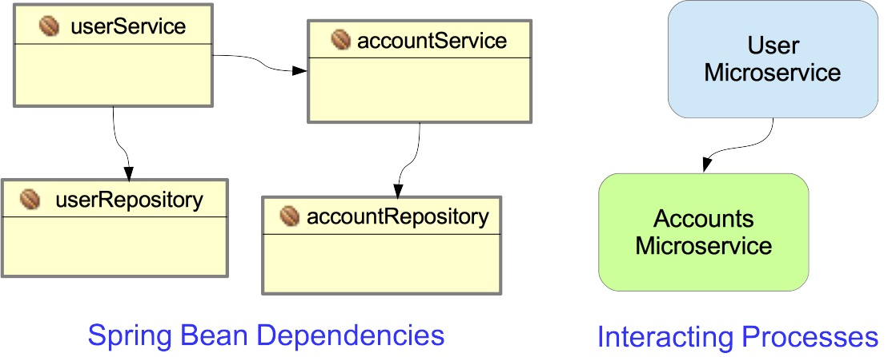
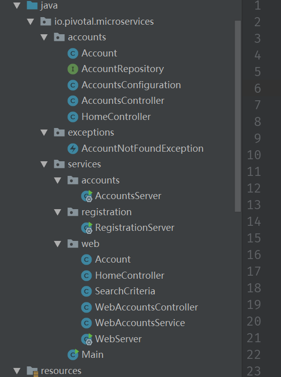
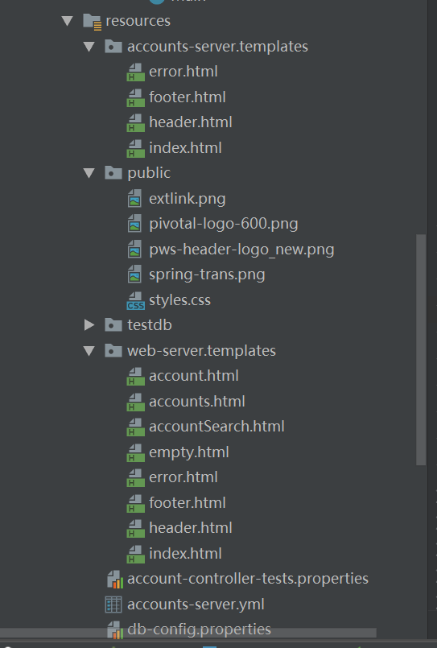
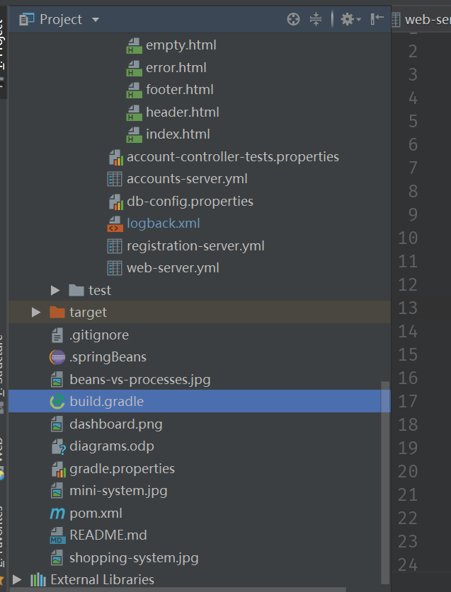

---

---

https://www.cnblogs.com/hyhnet/p/7998751.html


https://spring.io/blog/2015/07/14/microservices-with-spring


https://www.cnblogs.com/xiaojunbo/p/7094377.html


 


# Micro Service

> 微服务， microservices system using Spring, Spring Boot and Spring Cloud. 

## 介绍

### 特点

## 设计微服务

#### 1.Loosely Coupled（松耦合）

1. 可以独立的更新每个服务
2. 更新一个服务无需要求改变其他服务

如果你有一堆小的服务但不能独立更新，那也不叫微服务，因为这些服务并没有松耦合。原因之一，是有的公司将应用拆分了，但并没有拆分数据库，所有的应用仍然访问同一个数据库，你需要为每个服务拆分数据库。 

#### 2.为每个微服务提供独立的构建 

为每个微服务提供独立的构建，这样每个服务可以构建，独立发布，其他的服务依赖你的知识 Release 仓库里的某一个版本，他可以自行决定是升级你的最新版本，还是继续使用旧版本。

这样带来的是小团队的独立性，每个团队可以自己决定发布的周期，自己负责线上的问题。 

#### 3.**为每个微服务创建一个独立的数据存储** 

不要为微服务提供共享的后端数据存储。每个团队有选择最适合数据库的自由。

将数据库拆分会让数据管理变得复杂，因为独立的数据存储很容易出现数据不一致的问题，外键很容易被意外的破坏。

你需要工具来做主数据管理(MDM)，为后端服务修复不一致的问题。例如：你需要检查所有存储用户 ID 的数据库，确保每个数据库都有完整的用户 ID 的记录，不能存在某个数据库没有某个记录的情况。你可以自己实现这个工具，也可以用商业关系数据库的系统工具，但通常这些工具都有很多门槛，并且不易扩容.

#### 4.**将代码的成熟度保持在相同的水平** 

将代码的成熟度保持在相同的水平，如果你想增加或者重写某个已经稳定服务的微服务，最好的办法，是保留已有稳定运行的服务不变，创建一个新的微服务。

这是符合了 Immutable Infrastructure Principle，这本书的不可变基础设施理论。

这样你可以递进式的部署和测试新的代码，直到代码足够稳定， 高效运行，没有任何性能问题和部署失败问题的时候，你可以把代码 Merge 回之前的服务，完成新功能的开发。

#### 5.**组织结构变化** 

在微服务架构中，除了应用的重构，组织的结构也会发生变化，为了让微服务的团队实现独立自运营，公司必须成立专门的基础平台部门，也叫 SRE，这个部门为公司的研发团队提供统一的制品库管理，CI 工具（Jenkins 等），部署工具和运维，监控平台，以及应用的高可用保障。这样每个团队才能做到独立发布自己的服务。

#### 6.**部署到容器** 

部署微服务到容器(Doctor)里很重要，因为这意味着你只需要一个工具即可部署所有内容。一旦将微服务放在容器里，容器部署工具便知道如何部署它，无需考虑容器是什么类型。 

#### 7.**视服务器为无状态** 

对待服务器，特别是直接服务于用户的服务器，应该把它看成是一个原子服务里的某个持续变化的成员，你不需要去单独的考虑某个机器的状态，他们都应该提供一样的功能，无需区别对待。 

Cockcroft 的理论是：你应该将服务器看成是奶牛场里的牛，而不是宠物。单个的奶牛是用唯一编号标记，而宠物用名字标记。如果你的机器使用名字标记，并且处理某种特殊的应用，如果这个机器 Down 掉了，所有人都会受到影响。 

相反，如果你将机器看成是奶牛场里的奶牛， 你只关心每天生产出多少牛奶，如果某天发现牛奶产量比平时少了，你只需找到这头有问题的奶牛，把它替换掉。 


## 杂记

### 1. 看博客园的 小计 现在还不能总体性的概括


### 2.看官网的 小计 同上


想 知道 这跟 分布式 有和区别??各有什么优缺点？


一个 小 demo，RESTful接口

#### Eureka

首先 是需要一个注册中心，Netflix的Eureka，开源而且，能很好的与springcloud整合。

***启动类***

```java
@SpringBootApplication
@EnableEurekaServer
public class ServiceRegistrationServer {

  public static void main(String[] args) {
    // Tell Boot to look for registration-server.yml
    System.setProperty("spring.config.name", "registration-server");
    SpringApplication.run(ServiceRegistrationServer.class, args);
  }
}
```

***pom文件***

```xml
    <parent>
        <groupId>org.springframework.boot</groupId>
        <artifactId>spring-boot-starter-parent</artifactId>
        <version>2.0.1.RELEASE</version>
    </parent>

    <dependencies>
        <dependency>
            <!-- Setup Spring Boot -->
            <groupId>org.springframework.boot</groupId>
            <artifactId>spring-boot-starter</artifactId>
        </dependency>

        <dependency>
            <!-- Setup Spring MVC & REST, use Embedded Tomcat -->
            <groupId>org.springframework.boot</groupId>
            <artifactId>spring-boot-starter-web</artifactId>
        </dependency>

        <dependency>
            <!-- Spring Cloud starter -->
            <groupId>org.springframework.cloud</groupId>
            <artifactId>spring-cloud-starter</artifactId>
        </dependency>

        <dependency>
            <!-- Eureka for service registration -->
            <groupId>org.springframework.cloud</groupId>
            <artifactId>spring-cloud-starter-eureka-server</artifactId>
        </dependency>
    </dependencies>

   <!-- Spring Cloud dependencies -->
    <dependencyManagement>
        <dependencies>
            <dependency>
                <groupId>org.springframework.cloud</groupId>
                <artifactId>spring-cloud-dependencies</artifactId>
                <version>Finchley.RELEASE</version>
                <type>pom</type>
                <scope>import</scope>
            </dependency>
        </dependencies>
    </dependencyManagement>
```

@SpringBootApplication : 

​	=@Configuration + @EnableAutoConfiguration + @ComponentScan 

@EnableEurekaServer : 

​	告诉boot 启用Eureka服务

**注：System.setProperty("spring.config.name", "registration-server");** 

​	这句话是告诉boot 我要用什么配置文件。（"配置名，文件名"），如果一个工程里有多个boot应用会很有用

​	boot default是去找 `application.properties` or `application.yml` 


***配置文件***

```yaml
# Configure this Discovery Server
eureka:
  instance:
    hostname: localhost
  client:  # Not a client, don't register with yourself (unless running
           # multiple discovery servers for redundancy) 
           # 这里是告诉boot 我不是client 不要把我再Eureka中注册
    registerWithEureka: false
    fetchRegistry: false

server:
  port: 1111   # HTTP (Tomcat) port default是 runs on port 8761
```

注册中心的就结束了，很简单，当然springboot不仅支持Eureka，Consul也是可以的


#### A Microservice: *Account-Service*

***Question***：microService is not to interacting components (Spring Beans), but to interacting processes. 还不是很理解。



***启动类***

```java
@EnableAutoConfiguration
@EnableDiscoveryClient
@Import(AccountsWebApplication.class)
public class AccountsServer {

    @Autowired
    AccountRepository accountRepository;

    public static void main(String[] args) {
        // Will configure using accounts-server.yml
        System.setProperty("spring.config.name", "accounts-server");

        SpringApplication.run(AccountsServer.class, args);
    }
}
```

@EnableAutoConfiguration : 

​	定义为 springboot 应用

@EnableDiscoveryClient : 

​	允许该service 注册 和 发现服务，与配置文件配合

@Import(AccountsWebApplication.class) : 

​	关联一个配置类

***配置文件***

```yaml
# Spring properties
spring:
  application:
     name: accounts-service  # Service registers under this name
  freemarker:
    enabled: false           # Ignore Eureka dashboard FreeMarker templates
  thymeleaf:
    cache: false             # Allow Thymeleaf templates to be reloaded at runtime
    prefix: classpath:/accounts-server/templates/    # Trailing / mandatory
                             # Template location for this application only
     
#  Discovery Server Access
#  1. DEV ONLY: Reduce the lease renewal interval to speed up registration
#  2. Define URL of registration server (defaultZone)
eureka:
  client:
    serviceUrl:
      defaultZone: http://localhost:1111/eureka/
  instance:
    leaseRenewalIntervalInSeconds: 5   # DO NOT DO THIS IN PRODUCTION/默认client刷新时间，默认30s

# HTTP Server
server:
  port: 2222   # HTTP (Tomcat) port
  
# Map the error path to error template (for Thymeleaf)
error.path: /error

# Enable actuator access without security checks - DEVELOPEMENT ONLY
# management.security.enabled: false   Spring Boot 1.5 property
management.endpoints.web.exposure.include: '*'
```

#### webServer

***启动类***

```java
@SpringBootApplication
@EnableDiscoveryClient
@ComponentScan(useDefaultFilters = false) // Disable component scanner
public class WebServer {

	/**
	 * URL uses the logical name of account-service - upper or lower case,
	 * doesn't matter.
	 */
	public static final String ACCOUNTS_SERVICE_URL = "http://ACCOUNTS-SERVICE";

	/**
	 * Run the application using Spring Boot and an embedded servlet engine.
	 * 
	 * @param args
	 *            Program arguments - ignored.
	 */
	public static void main(String[] args) {
		// Tell server to look for web-server.properties or web-server.yml
		System.setProperty("spring.config.name", "web-server");
		SpringApplication.run(WebServer.class, args);
	}

	/**
	 * A customized RestTemplate that has the ribbon load balancer build in.
	 * Note that prior to the "Brixton" 
	 * 
	 * @return
	 */
	@LoadBalanced
	@Bean
	RestTemplate restTemplate() {
		return new RestTemplate();
	}

	/**
	 * The AccountService encapsulates the interaction with the micro-service.
	 * 
	 * @return A new service instance.
	 */
	@Bean
	public WebAccountsService accountsService() {
		return new WebAccountsService(ACCOUNTS_SERVICE_URL);
	}

	/**
	 * Create the controller, passing it the {@link WebAccountsService} to use.
	 * 
	 * @return
	 */
	@Bean
	public WebAccountsController accountsController() {
		return new WebAccountsController(accountsService());
	}

	@Bean
	public HomeController homeController() {
		return new HomeController();
	}
}

```

@ComponentScan(useDefaultFilters = false) : 这是不用springboot的默认配置，自己来配置

@Beans : 就是将方法返回的类作为此类的成员变量

@LoadBalanced ：负载均衡

***配置文件***

```yaml
# Ignore JDBC Dependency
# This demo puts 3 applicatons in the same project, so by default they all pick
# up the JDBC Depdendency, but this application doesn't need it.
spring.autoconfigure.exclude: org.springframework.boot.autoconfigure.jdbc.DataSourceAutoConfiguration

# Spring properties
spring:
  application:
    name: web-service  # Identify this application
  freemarker:
    enabled: false     # Ignore Eureka dashboard FreeMarker templates
  thymeleaf:
    cache: false       # Allow Thymeleaf templates to be reloaded at runtime
    prefix: classpath:/web-server/templates/    # Trailing / mandatory
                       # Template location for this application only

# Map the error path to error template (for Thymeleaf)
error.path: /error

# HTTP Server
server.port: 3333   # HTTP (Tomcat) port

# Discovery Server Access
#  1. DEV ONLY: Reduce the lease renewal interval to speed up registration
#  2. Define URL of registration server (defaultZone)
eureka:
  client:
    serviceUrl:
      defaultZone: http://localhost:1111/eureka/
  instance:
    leaseRenewalIntervalInSeconds: 5   # DO NOT DO THIS IN PRODUCTION

# Enable actuator access without security checks - DEVELOPEMENT ONLY
# management.security.enabled: false   Spring Boot 1.5 property
management.endpoints.web.exposure.include: '*'
  
```

#### ***结构图***








