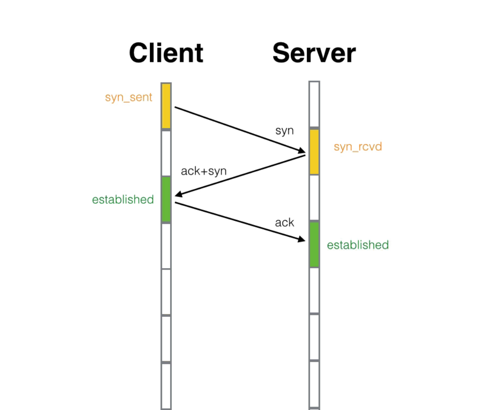
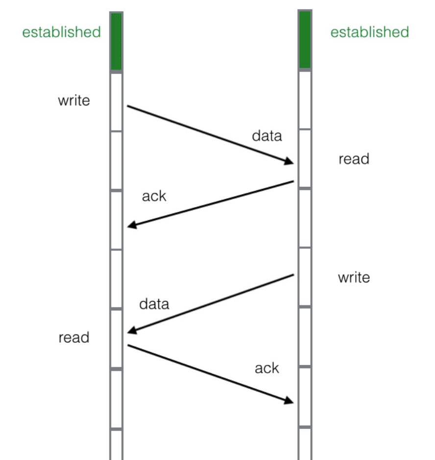
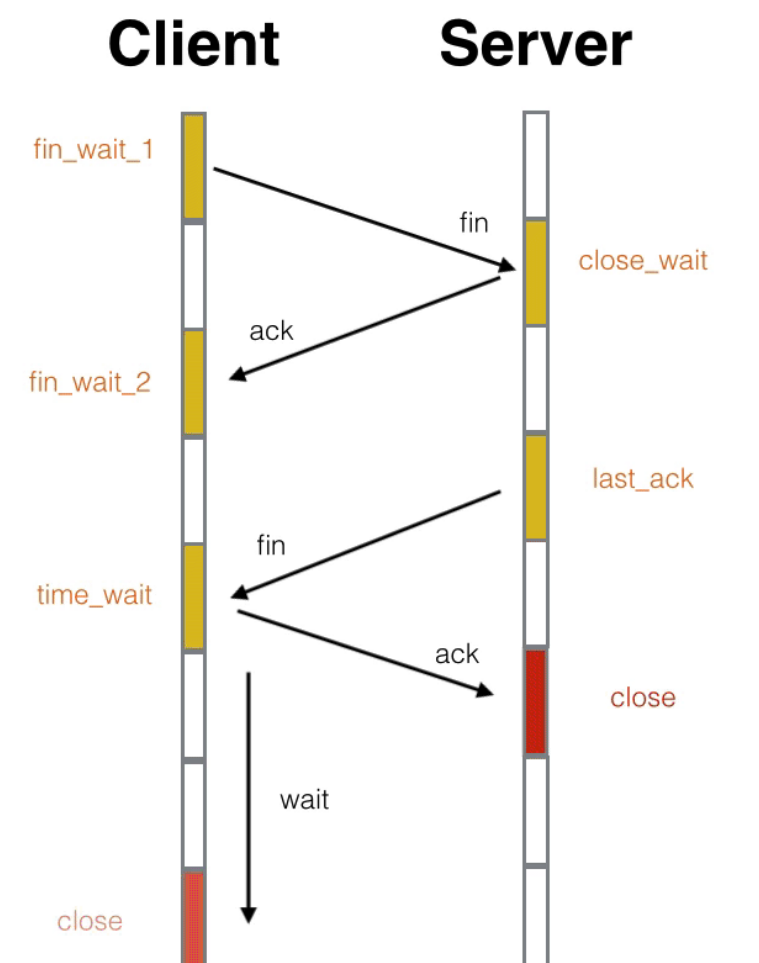

# TCP 的三次握手 四次挥手

## 三次握手

如图，客户端 首先会向 服务端 招手（syn）确认对方是否认识自己，服务器端 看到了 客户端的招手，点头微笑表示我认识你（ack），同时 也会向 客户端招手 确定 客户端是不是再跟自己打招呼（syn），客户端 看到了 服务端的微笑点头（ack），于是变成了established状态，并向 服务端 微笑点头，服务端 也看到了 客户端的微笑点头（act），便 也进入了 established状态。

## TCP数据传输

当客户端和服务器端连接上了，都除了established 状态，便可以开始进行数据传输了。

每次 传输过程后，都会给 对方发送一个消息 说明 东西我收到了，我们还连着。（这就叫 tcp 回传）

如果发送方没有收到回话，他会认为 自己发送的data被大风吹走了，要么 人家的回话 被大风吹走了。之后会进行重新传输。

客户端不是只会一句一句的说，可以一连说8句话，服务器批量接受，统一回复，这就是批量ack 。

但两人之间需要有协商好的合适的发送和接受速率，这个就是「TCP窗口大小」。不能一下发送很多很多句话。

## 四次挥手

之所以中间的两个动作没有合并，是因为tcp存在「半关闭」状态，也就是单向关闭。张三已经挥了手，可是人还没有走，只是不再说话，但是耳朵还是可以继续听，李四呢继续喊话。等待李四累了，也不再说话了，朝张三挥了挥手，张三伤感地微笑了一下，才彻底结束了。 

上面有一个非常特殊的状态`time_wait`，它是主动关闭的一方在回复完对方的挥手后进入的一个长期状态，这个状态标准的持续时间是4分钟，4分钟后才会进入到closed状态，释放套接字资源。不过在具体实现上这个时间是可以调整的。

它就好比主动分手方要承担的责任，是你提出的要分手，你得付出代价。这个后果就是持续4分钟的`time_wait`状态，不能释放套接字资源(端口)，就好比守寡期，这段时间内套接字资源(端口)不得回收利用。

它的作用是重传最后一个ack报文，确保对方可以收到。因为如果对方没有收到ack的话，会重传fin报文，处于`time_wait`状态的套接字会立即向对方重发ack报文。

同时在这段时间内，该链接在对话期间于网际路由上产生的残留报文(因为路径过于崎岖，数据报文走的时间太长，重传的报文都收到了，原始报文还在路上)传过来时，都会被立即丢弃掉。4分钟的时间足以使得这些残留报文彻底消逝。不然当新的端口被重复利用时，这些残留报文可能会干扰新的链接。